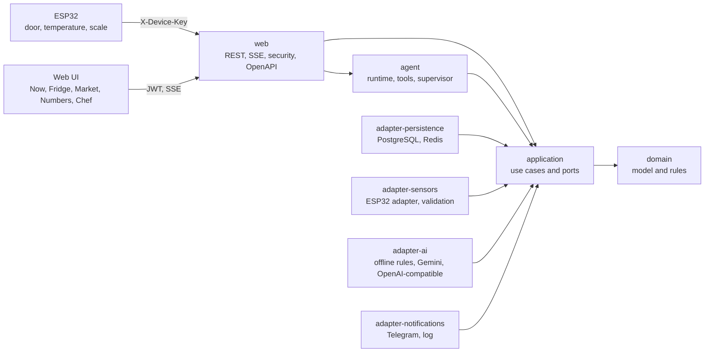

<p align="center"></p>

# HayPaComer

**Weigh it. Know it. Cook it.**

[](https://github.com/Juansit-0/HayPaComer/actions/workflows/ci.yml)


Smart home fridge that answers a daily question: **what can I cook right now with what is actually at home?** A Java backend, an ESP32 module, and a kitchen scale keep a live inventory in grams, with expiry dates, food ownership, door openings, and the cold chain. Camera apps guess; HayPaComer measures. Premium fridges cost thousands; HayPaComer upgrades a normal one.

Version **1.0.0**. Changes are in [`CHANGELOG.md`](CHANGELOG.md).

## What it does

- **Live inventory in grams:**
  - the fridge is drawn zone by zone and shelf by shelf;
  - the scale discounts what you take, minus the jar;
  - every change is an audited command with undo and snapshots;
  - simultaneous uses of the same food never lose grams.
- **Food ownership:** shared, ask-first, or private food per member, with grants. Other members see "Private food" without details.
- **Cold chain and door:**
  - validated sensor events raise one alert per episode: door open 40 s, or above 5 C for 20 minutes;
  - the alerts reach the buzzer, the web inbox, Telegram, and the live panel;
  - a cold investigation rebuilds the timeline, names the likely cause, and gives each food a verdict by the 2 hour rule.
- **Cook now:**
  - recipes are evaluated against measured stock with strict, flexible, or rescue strategies;
  - quantities like "0,15 kg" or "2 huevos" are understood;
  - substitutions respect proportion, limits, and every diner's allergies and diet.
- **Guided cooking:**
  - sessions advance step by step with timers and weighing targets;
  - a scale copilot says how much more to add or how to rescale the rest of the recipe;
  - voice commands work hands free.
- **Plan and shop:**
  - a rescue-first weekly plan, clonable templates, and plan delta into a market list grouped by aisle;
  - a monthly budget that puts plan needs first and suggests cheaper allowed substitutes.
- **AI and agent:**
  - a supervisor routes questions to chef, market, cold, and coach specialists with real tools;
  - every answer comes with the evidence it used;
  - writes wait for a person's confirmation;
  - proactive briefings arrive in the morning, when foods cluster to expire, after alerts, and as a weekly digest;
  - photo to verified recipe.
- **Numbers:** grams rescued, money saved, waste rate, a household ranking, and CSV or Markdown reports, all from measured movements.

## Architecture

Hexagonal architecture in 8 single-responsibility Maven modules. Boundaries are enforced by `maven-enforcer` and ArchUnit: no frameworks in `domain`, `application`, or `agent`; adapters never depend on each other; nothing depends on `web`.



| Module | Responsibility |
|---|---|
| `domain` | Model and business rules in plain Java: fridge composite, stocked food decorators, cold chain state, cooking session state, quantities, substitutions, planning, analytics, cold investigation |
| `application` | Use cases (one public method each) and segregated ports |
| `adapter-persistence` | PostgreSQL with Flyway (25 migrations, partitioned sensor events, runtime settings and translations with cache), Redis for all AI state, resilient reference data proxies |
| `adapter-sensors` | ESP32 envelopes, factories, simulator, in-memory sessions |
| `adapter-ai` | Offline rule engine, Gemini and OpenAI-compatible clients with strict JSON contracts, circuit breaker |
| `adapter-notifications` | Telegram and log channels, email links |
| `agent` | Plan-tool-observation runtime with budgets, tool registry and guardrails, memory, supervisor, copilot, proactive briefings |
| `web` | Spring Boot: REST API (122 endpoints, RFC 7807 errors, OpenAPI at `/docs`), SSE, JWT and device keys, the web UI |

Relational data lives in PostgreSQL. AI state (memory, conversations, traces, confirmations, cache, circuit breaker, rate limits, briefings) lives in Redis. Losing Redis never loses stock, grams, or safety decisions. More in [`docs/architecture.md`](docs/architecture.md) and the decision records in [`docs/adr/`](docs/adr).

## Design patterns

All 23 GoF patterns plus Null Object, each in production code with a test. Full descriptions are in [`docs/patterns.md`](docs/patterns.md).

| Pattern | Where |
|---|---|
| Singleton | One `FridgeSession` per fridge through the session registry |
| Factory Method | `Esp32EventFactory` per sensor event type |
| Abstract Factory | `HardwareFactory` builds decoders and alert signals per device kind |
| Builder | `SuggestionQuery.builder()` |
| Prototype | `Recipe.copy()` and `WeeklyPlan.cloneFor` |
| Adapter | `Esp32EventAdapter`, LLM clients |
| Bridge | Measurement channels x interpretations in the fridge monitor |
| Composite | `Fridge` -> `Zone` -> `Tray` -> `FoodItem` |
| Decorator | Expired, at risk, leftover, owned, and under review food |
| Facade | `HayPaComerFacade` |
| Flyweight | `FoodMetadataCatalog` |
| Proxy | `ResilientKitchenAdvisor`, `PrivateFoodProxy`, resilient reference data |
| Chain of Responsibility | Sensor event validation and agent guardrails |
| Command | Stock, consume, and discard inventory commands |
| Interpreter | `QuantityParser` |
| Iterator | `FridgeTreeIterator` |
| Mediator | `GuidedCookingMediator` |
| Memento | Fridge snapshots, undo, and restore |
| Observer | Household notifications and live updates |
| State | Cold chain and cooking sessions |
| Strategy | Recipe evaluation, weekly planning, notification channels |
| Template Method | `ReportTemplate` |
| Visitor | Report sections |
| Null Object | `NullChatModel` defers to the offline rules |

## Responsible AI

The model never writes to the database and never decides safety.
- **Measured data only:** grams come from the scale and the inventory.
- **Rules decide safety:** risk comes from the freshness, cold chain, and 2 hour rules.
- **Strict contracts:** every model answer passes a strict JSON contract.
- **Grounded agent:** answers that quote grams no tool measured are refused.
- **People confirm writes:** every write the agent proposes waits for the person who asked.
- **Degrades instead of failing:** one circuit breaker per provider falls back to offline rules.

See [`docs/responsible-ai.md`](docs/responsible-ai.md) and [`docs/agent.md`](docs/agent.md).

## Quality

- More than 670 automated tests:
  - unit tests per module;
  - Testcontainers integration tests on PostgreSQL 18 and Redis 8;
  - security tests that walk every endpoint;
  - a full demo test with a 500-event noise batch and concurrent users.
- JaCoCo line coverage of at least 80% in `domain`, `application`, and `agent`; Spotless (google-java-format) on every build.
- CI on every pull request: the Maven build and a firmware job that compiles the ESP32 sketches. `main` is protected and only accepts rebased pull requests with a green build.

## Run locally

Requirements: Java 25, Maven 3.9+, and Docker with Compose.

```bash
cp .env.example .env
docker compose up -d
mvn verify
```

`docker compose up -d` starts PostgreSQL 18 and Redis 8 (AOF on), bound to `127.0.0.1` only. Edit the passwords and `JWT_SECRET` (at least 32 bytes) in `.env` first; `.env` is never committed. `AI_PROVIDER` is `offline` by default; set `gemini` or `openai-compatible` with its key to use a model.

Run the app with the variables from `.env` exported:

```bash
set -a && source .env && set +a
mvn -pl web -am spring-boot:run
```

Then open `http://localhost:8080`. The web UI has five screens:
- **Now:** what to use first, the live feed, cook now.
- **Fridge:** the cabinet shelf by shelf.
- **Market:** by aisle, the cart, the budget.
- **Numbers:** what the fridge saved, ranking, reports.
- **Chef:** chat and voice, confirmations, guided steps.

The API catalog is at `/docs`.

## Demo

Door open 40 s -> buzzer, Telegram, and a live panel. Milk 842 g -> 650 g -> 192 g consumed, tare included. Chicken 200 g required vs 80 g measured -> reduce or weigh a substitute. AI outage -> rules keep dinner working.

The 12 minute script, a seed script, and simulated sensors are in [`docs/demo.md`](docs/demo.md). Hardware and wiring are in [`docs/hardware.md`](docs/hardware.md) and [`docs/firmware.md`](docs/firmware.md).

## Documentation

- [`PLAN.md`](PLAN.md): master plan; progress in [`docs/ROADMAP.md`](docs/ROADMAP.md).
- [`docs/api.md`](docs/api.md): REST catalog.
- [`docs/database.md`](docs/database.md): data model and Redis key map.
- [`docs/event-protocol.md`](docs/event-protocol.md): ESP32 events.
- [`brand/brand-book.md`](brand/brand-book.md): brand, voice, and design tokens.
- [`docs/proposal/`](docs/proposal): original proposal (LaTeX + PDF).
- [`CONTRIBUTING.md`](CONTRIBUTING.md): setup, rules, and the pull request workflow; step guides in [`docs/tasks/`](docs/tasks/README.md).

## Team

- **Juan Camilo López Díaz** (owner): foundation, domain, persistence, authentication, sensors, scale, guided cooking, AI adapters, and the web interface.
- **Jenifer Urbano:** planning, notifications, the API contract, the agent layer, analytics and reports, resilience, the hands-free voice, performance, and the demo.
