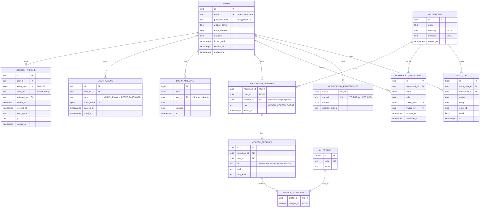
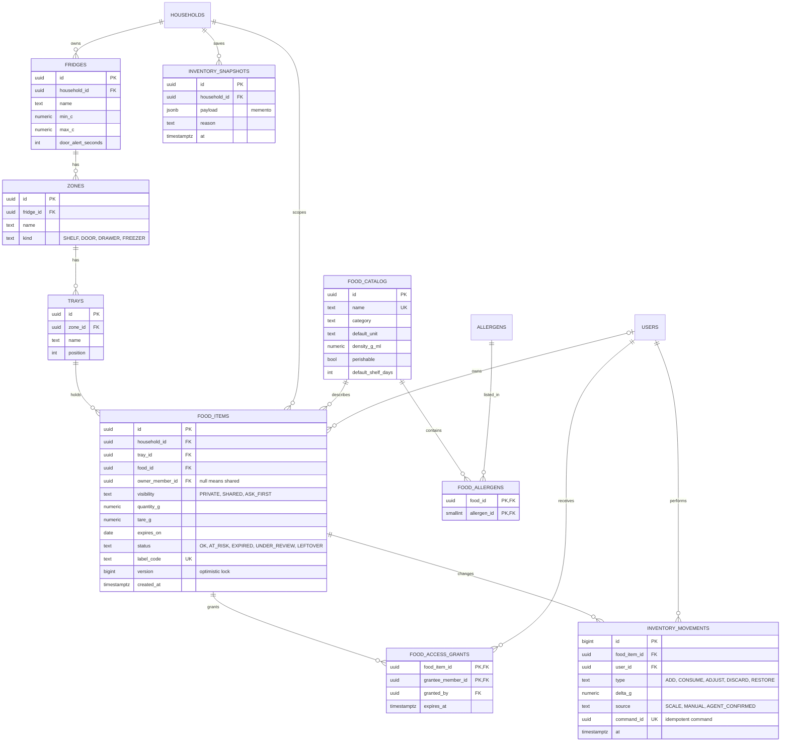
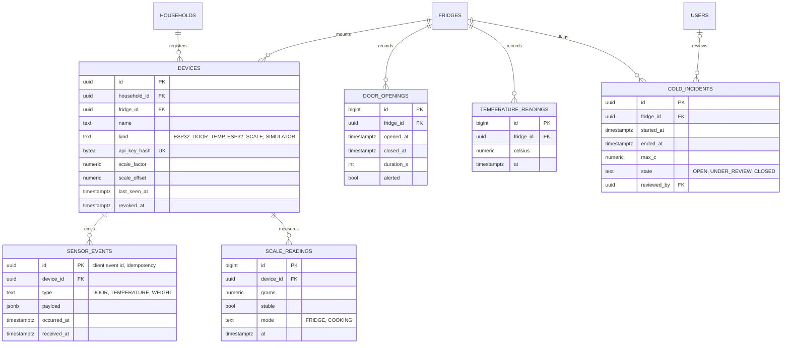

# Data model

HayPaComer uses two stores with one rule: **relational data in PostgreSQL, AI state in Redis**.

| Store | Holds | Why |
|---|---|---|
| PostgreSQL 18 + Flyway | Identity and authentication, households, fridges, inventory, sensors, recipes, cooking, market, planning, notifications, audit | Transactions, foreign keys, constraints, and reporting queries over measured data |
| Redis 8 (AOF on) | Agent memory, conversations, run traces, AI audit stream, pending confirmations, AI response cache, circuit breaker and rate limit state | Short-lived or append-only, schema-flexible, TTL-driven data that must never become the source of truth |

The agent never writes to PostgreSQL. An approved confirmation in Redis triggers the real use case in `application`, which validates and writes.

Conventions: `uuid` primary keys generated by the application; `bigint` identity keys for high-volume append-only tables; all timestamps `timestamptz` in UTC; quantities in grams as `numeric(10,2)`; enumerations stored as `text` with `CHECK` constraints; secrets and tokens stored only as hashes.

## 1. Identity, authentication, and households

## 2. Fridge tree and inventory

## 3. Devices and sensors

## 4. Recipes, cooking, market, planning, and notifications

```mermaid
erDiagram
  HOUSEHOLDS |o--o{ RECIPES : keeps
  RECIPES |o--o{ RECIPES : cloned_from
  RECIPES ||--o{ RECIPE_STEPS : has
  RECIPES ||--o{ RECIPE_REQUIREMENTS : needs
  FOOD_CATALOG ||--o{ RECIPE_REQUIREMENTS : required
  FOOD_CATALOG ||--o{ SUBSTITUTION_RULES : from_or_to
  RECIPES ||--o{ COOKING_SESSIONS : cooked_in
  USERS ||--o{ COOKING_SESSIONS : starts
  COOKING_SESSIONS ||--o{ SESSION_STEP_LOGS : logs
  COOKING_SESSIONS ||--o{ SUBSTITUTIONS : applies
  SUBSTITUTION_RULES ||--o{ SUBSTITUTIONS : follows
  FOOD_ITEMS ||--o{ SUBSTITUTIONS : uses
  HOUSEHOLDS ||--o{ ACCEPTED_SUGGESTIONS : learns
  RECIPES ||--o{ ACCEPTED_SUGGESTIONS : accepted
  HOUSEHOLDS ||--|| MARKET_LISTS : has
  MARKET_LISTS ||--o{ MARKET_ITEMS : contains
  FOOD_CATALOG ||--o{ MARKET_ITEMS : buys
  HOUSEHOLDS ||--o{ WEEKLY_PLANS : plans
  WEEKLY_PLANS ||--o{ PLAN_ENTRIES : has
  RECIPES ||--o{ PLAN_ENTRIES : scheduled
  HOUSEHOLDS ||--o{ NOTIFICATIONS : receives
  USERS ||--o{ NOTIFICATIONS : targets

  RECIPES {
    uuid id PK
    uuid household_id FK "null means global template"
    uuid cloned_from FK "prototype"
    text name
    int servings
    int minutes
    bool is_template
    text source "MANUAL, PHOTO_AI, TEMPLATE"
  }
  RECIPE_STEPS {
    uuid id PK
    uuid recipe_id FK
    int position
    text instruction
    int timer_s
    uuid weigh_food_id FK
    numeric target_g
  }
  RECIPE_REQUIREMENTS {
    uuid recipe_id PK,FK
    uuid food_id PK,FK
    numeric grams
    bool optional
  }
  SUBSTITUTION_RULES {
    uuid id PK
    uuid from_food_id FK
    uuid to_food_id FK
    numeric ratio
    numeric max_g
  }
  COOKING_SESSIONS {
    uuid id PK
    uuid household_id FK
    uuid recipe_id FK
    uuid started_by FK
    text state "PREPARING, COOKING, PAUSED, FINISHED, ABANDONED"
    int current_step
    int servings
    timestamptz started_at
    timestamptz finished_at
  }
  SESSION_STEP_LOGS {
    bigint id PK
    uuid session_id FK
    int position
    numeric measured_g
    timestamptz at
  }
  SUBSTITUTIONS {
    uuid id PK
    uuid session_id FK
    uuid rule_id FK
    uuid food_item_id FK
    numeric measured_g
    uuid accepted_by FK
    timestamptz at
  }
  ACCEPTED_SUGGESTIONS {
    uuid id PK
    uuid household_id FK
    uuid recipe_id FK
    uuid user_id FK
    int servings
    timestamptz at
  }
  MARKET_LISTS {
    uuid id PK
    uuid household_id FK,UK
    timestamptz updated_at
  }
  MARKET_ITEMS {
    uuid id PK
    uuid list_id FK
    uuid food_id FK
    numeric grams_needed
    text source "MANUAL, RECIPE, PLAN, AGENT_CONFIRMED"
    uuid added_by FK
    bool checked
  }
  WEEKLY_PLANS {
    uuid id PK
    uuid household_id FK
    uuid cloned_from FK
    date week_start
  }
  PLAN_ENTRIES {
    uuid id PK
    uuid plan_id FK
    smallint day "1-7"
    text meal "BREAKFAST, LUNCH, DINNER"
    uuid recipe_id FK
    int servings
  }
  NOTIFICATIONS {
    uuid id PK
    uuid household_id FK
    uuid user_id FK
    text channel
    text type
    jsonb payload
    text status "PENDING, SENT, FAILED"
    timestamptz sent_at
    timestamptz read_at
  }
```

## Key constraints and indexes

- Migrations live in `adapter-persistence/src/main/resources/db/migration` (Flyway). `V1` creates identity, households, members, profiles, and audit; `V2` creates the food catalog, fridge tree, and inventory. Later features add their own migrations.
- Food ownership and grants reference `household_members.member_id`, the same `MemberId` the domain uses for profiles and ownership.
- `food_catalog.name_key` (lowercase, trimmed) is unique and is how the domain identifies a food.

- `household_members`: exactly one `OWNER` per household enforced by a partial unique index `(household_id) WHERE role = 'OWNER'`.
- `market_items`: partial unique index `(list_id, food_id) WHERE NOT checked` keeps the list free of duplicates.
- `food_items`: index `(household_id, expires_on)` for expiry queries; `CHECK (quantity_g >= 0)`; `version` for optimistic locking.
- `sensor_events.id` is the client-generated event id; a duplicate insert is a no-op (idempotent ingestion).
- `inventory_movements.command_id` unique: a replayed command never discounts twice.
- `refresh_tokens`: index `(family_id)`; reuse of a revoked token revokes the whole family.
- `temperature_readings`, `scale_readings`, `door_openings`: index `(fridge_id or device_id, at DESC)`; old rows can be partitioned by month.
- Analytics (kg saved, money avoided, ranking, trend) are queries over `inventory_movements`; no duplicated aggregate tables.

## Redis key map (AI state)

| Key | Type | TTL | Content |
|---|---|---|---|
| `agent:memory:{householdId}` | Hash | none | Preferences, usual quantities, accepted dishes, decisions; editable by the household |
| `agent:conv:{conversationId}` | Stream | 7 d | Chef chat messages |
| `agent:convs:{userId}` | Sorted set | 7 d | Conversation index by last activity |
| `agent:run:{runId}` | Hash | 30 d | Run status, specialist, steps and budget used |
| `agent:trace:{runId}` | Stream | 30 d | Plan, tool call, and observation steps with arguments and results |
| `agent:pending:{confirmationId}` | Hash | 10 min | Write proposed by the agent awaiting human confirmation |
| `agent:pending:user:{userId}` | Set | 10 min | Index of pending confirmations per user |
| `ai:audit` | Stream (MAXLEN ~100000) | none | Provider, latency, valid or rejected, fallback used |
| `ai:cache:{sha256}` | String (JSON) | 1 h | Validated AI response cache (Proxy) |
| `ai:cb:{provider}` | Hash | none | Circuit breaker state and counters |
| `ai:ratelimit:{userId}` | String counter | 1 min | AI calls per user per minute |

Redis keys reference PostgreSQL ids (`householdId`, `userId`) but never duplicate inventory or quantities. If Redis is lost, the system loses conversation history and caches, never stock, grams, or safety decisions.
